<p align="center">
  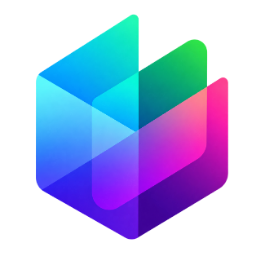
</p>

<h1 align="center">Halo — Spatial OS</h1>

<p align="center"><b>English</b> · <a href="README.pt-BR.md">Português (Brasil)</a></p>

<p align="center">
  <b>An all-in-one app for Linux: system meters, files, movies, music, Docker and Claude Code agents<br>
  in one window, plus a dynamic island, a Meta+V launcher and one-click themes.</b><br>
  For KDE Plasma 6.
</p>

<p align="center">
  <a href="https://github.com/jrcn1991/app_halo-spatial-os/releases/latest"></a>
  <a href="https://jrcn1991.github.io/app_halo-spatial-os/#demo"></a>
  <a href="https://jrcn1991.github.io/app_halo-spatial-os/"></a>
</p>

<p align="center">
  
  
  
  
  <a href="LICENSE"></a>
</p>

<p align="center">
  <a href="https://jrcn1991.github.io/app_halo-spatial-os/#demo">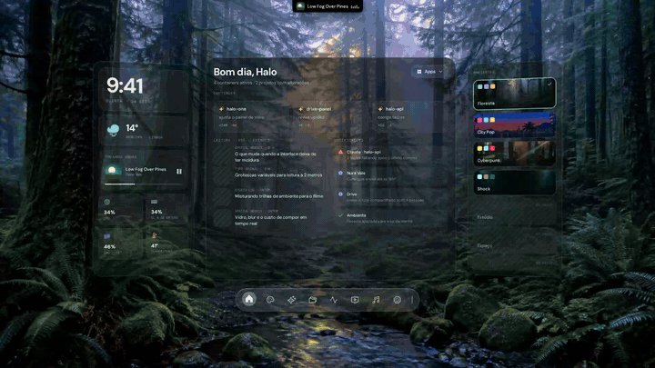</a>
  <br>
  <sub>▶ <a href="https://jrcn1991.github.io/app_halo-spatial-os/#demo">Try the interactive demo in your browser</a> — the island, the launcher, the eight screens and the four themes, with sample data</sub>
</p>

<p align="center">
  <a href="#the-dynamic-island">Island</a> ·
  <a href="#the-launcher-metav">Launcher</a> ·
  <a href="#four-environments">Environments</a> ·
  <a href="#notifications-dressed-by-the-theme">Notifications</a> ·
  <a href="#eight-screens">Screens</a> ·
  <a href="#installation">Install</a> ·
  <a href="#privacy">Privacy</a>
</p>

---

Say hello to **Halo**: a way to make the Linux desktop feel like a spatial
operating system. The window is **transparent** — there is no background at
all, only glass panels tilted in 3D that float over your wallpaper and never
cover your other windows. At the top of the screen lives a **dynamic island**,
in the spirit of the Mac notch: music, timers, clipboard, notifications and a
launcher one shortcut away. And each **environment** switches the app's theme
and your session wallpaper in one go.

> [!NOTE]
> The interface speaks **Brazilian Portuguese** by default and **English** as
> an option: Configurações → Idioma (Settings → Language). The switch applies
> right away, in every window. The images on this page show the Portuguese
> interface.

## Highlights

|  |  |
|---|---|
| 🏝️ **Dynamic island** | A pill at the top of the screen that opens on hover: now playing with the real sound spectrum, timers, clipboard, windows, a file drawer, notifications, a note and Claude. **On by default.** |
| ⌨️ **Launcher on Meta+V** | One field for apps, commands, math, unit conversion, emoji, web search and windows — the same engine as the island, dressed by the environment. |
| 🎨 **Four environments** | Floresta, City Pop, Cyberpunk and Shock switch the interface theme **and** the Plasma wallpaper (image or video). |
| 💬 **Themed notifications** | Plasma stays the notification server; Halo redraws the bubbles in the environment's style. |
| 🪟 **Eight screens** | Home, Social, Claude, Files, Lab, Media, Music and Settings — three glass panels each, and a dock. |
| 📈 **Real data** | CPU, memory, GPU and temperature, git repositories, Docker, disks, what's playing (MPRIS) — read from your machine, never made up. |
| ✳️ **Claude Code** | One agent per project, with conversation history and an optional Microsoft Agent mascot. |
| 🎬 **Media and music** | Your own M3U library with TMDB synopsis, a player that stays on top, and Spotify. |

## The dynamic island

<p align="center">
  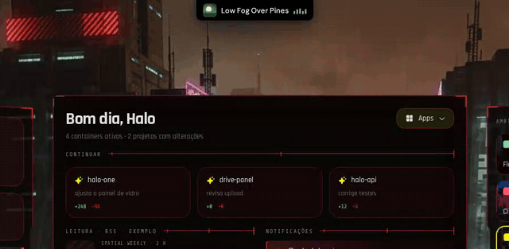
</p>

A black pill sits **on top of the Plasma panel**, like a notch on the menu bar.
Closed, it shows what matters now — the cover and the sound wave of what's
playing, a running timer, an announcement that widens and folds back (a
finished download, the volume HUD). Hover it (or click, if you prefer) and it
opens into eight tabs:

| Tab | What's there |
|---|---|
| **Início** (Home) | The player with cover, progress and volume; Halo, Wi-Fi, Bluetooth and Do Not Disturb; mute, microphone, caffeine, show desktop, screenshot and lock; timers and stopwatch; and the launcher field. With nothing playing, a panorama of clock, weather and live meters takes the player's place. |
| **Painéis** (Panels) | Every module in detail: system, GPU, audio outputs, network, Bluetooth, disks and USB drives, phone (KDE Connect), focus week, ports, services. |
| **Claude** | Ask with `?` in the island's field; answers and permission prompts (✓ / ✗) right in the pill. |
| **Gaveta** (Drawer) | Drop files, links or text on the pill to keep them at hand, and drag them back out. |
| **Janelas** (Windows) | Put a window away in the drawer — the KWin effect flies the real window into the pill — and bring it back. |
| **Avisos** (Notices) | The latest system notifications. |
| **Cópias** (Copies) | Clipboard history with smart actions for links, colors and e-mails. |
| **Nota** (Note) | A quick note that survives restarts. |

**Meta+Space** folds the whole app into the island and brings it back. The
island is **on by default** on a fresh install — it's the front door of the app,
since the main window starts collapsed. Everything is in **Configurações → Ilha**.

## The launcher (Meta+V)

<p align="center">
  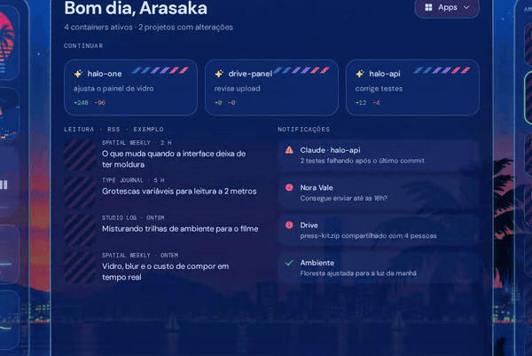
</p>

**Meta+V** opens a launcher window on the screen you're working on, dressed by
the current environment. The field understands:

| Type | Example | Does |
|---|---|---|
| App or command | `fire`, `cafe` | opens Firefox; toggles caffeine |
| Math | `2+2`, `15% de 240` | shows the result; Enter copies |
| Conversion | `30c em f`, `2 gb em mb` | temperature, size, length… |
| Emoji | `:coracao` | copies the symbol |
| Web search | `g kde plasma` | opens the search in your browser |
| Claude | `? how do I…` | asks the island's Claude |

With the field empty it lists what you use most (frequency with recency). The
island's field is the **same engine**, so whatever one learns, the other knows.
Meta+V belongs to Klipper by default: turning the launcher on in
**Configurações → Lançador** borrows the key, and turning it off gives it back.

## Four environments

| Floresta | City Pop |
|:---:|:---:|
| 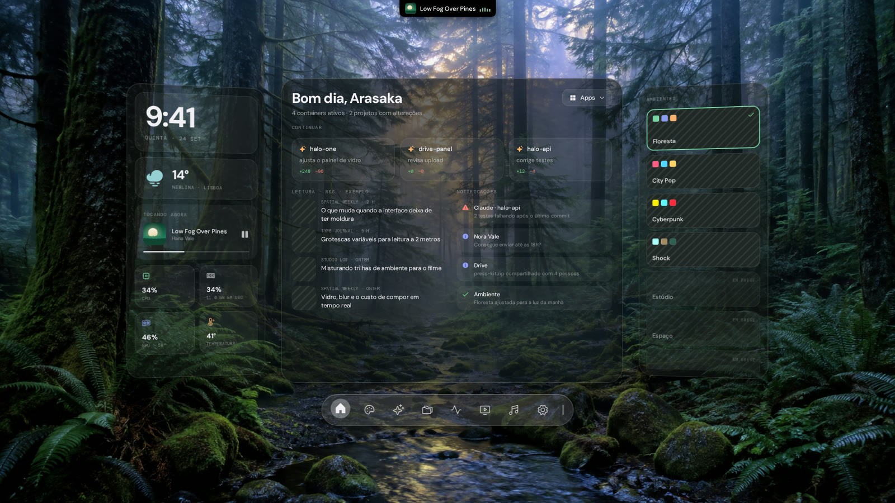 | 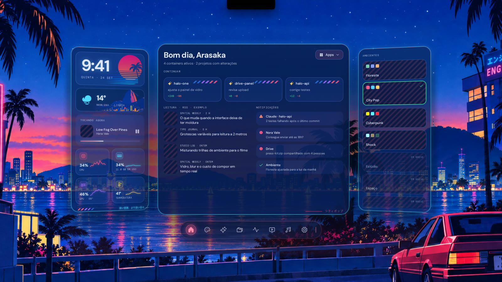 |
| **Cyberpunk** | **Shock** |
| 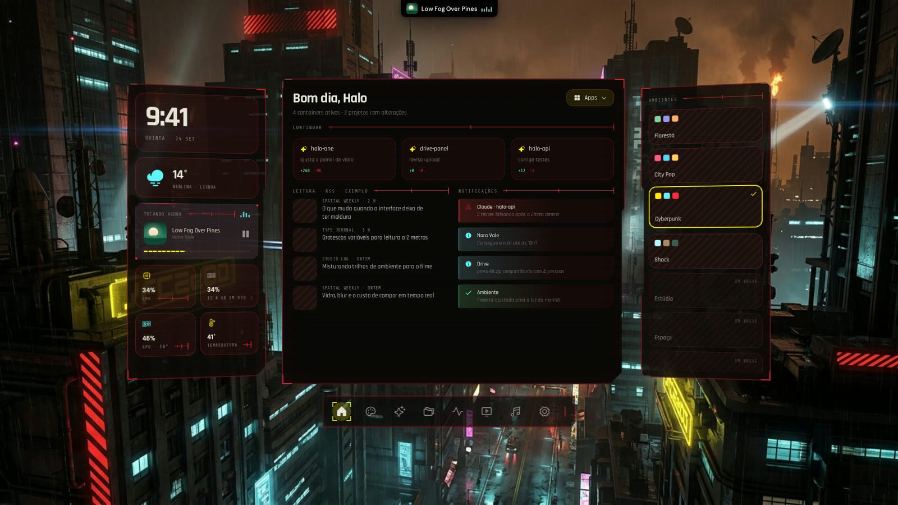 | 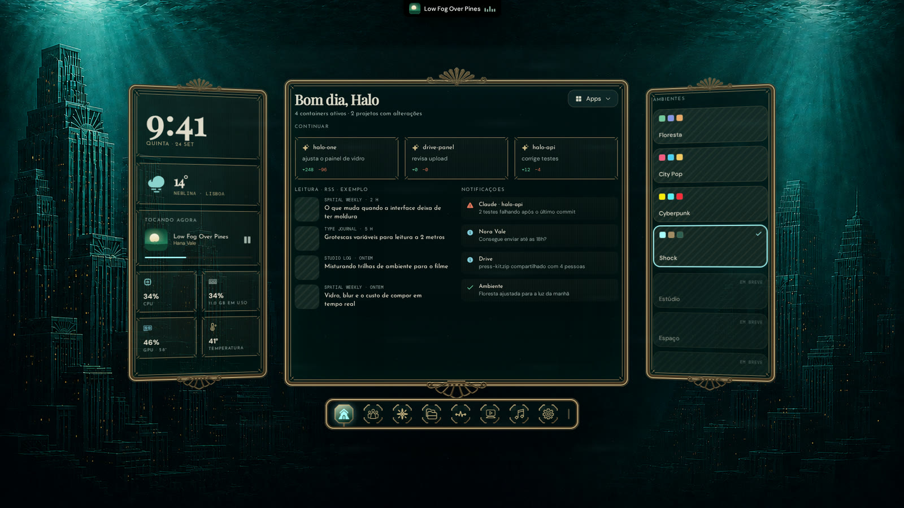 |

An environment is **the app's theme plus your session wallpaper**. Pick one in
the right panel of Home: panels, fonts, the dock, the launcher and the
notification bubbles all change, and Plasma gets the environment's wallpaper
(or video). Before the first switch Halo saves your own wallpaper, and
**Configurações → Ambiente → Restaurar o meu papel de parede** gives it back.
Glass preferences — transparency, brightness, entrance animation — are
**per environment**.

## Notifications dressed by the theme

<p align="center">
  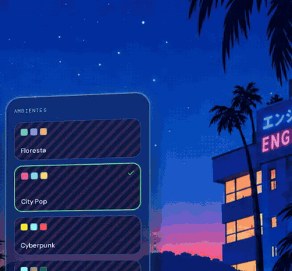
</p>

<p align="center">
  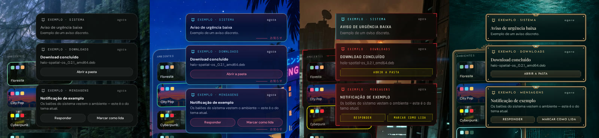
</p>

Turn on **Configurações → Notificações** and Halo becomes a *watcher* of the
Plasma notification server: Plasma's bubbles are hidden and Halo draws its own,
with the environment's glass, fonts and entrance. Clicking an action goes back
to the app that sent it. Plasma keeps the history, the bell and critical
notifications, and closing Halo gives the bubbles back immediately. Off until
you turn it on.

## Eight screens

<p align="center">
  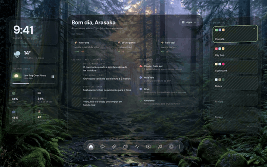
</p>

| Home | Social |
|:---:|:---:|
| 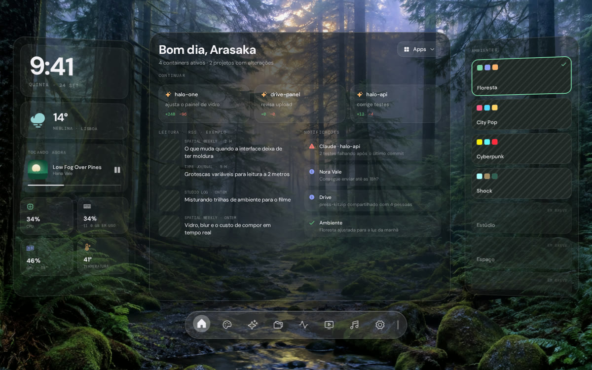 | 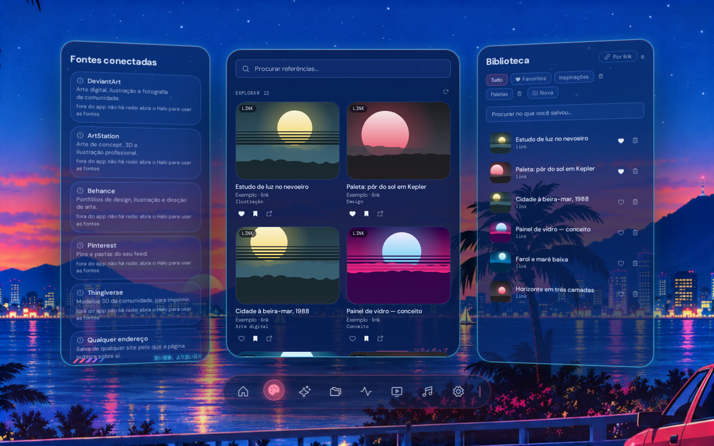 |
| Clock, weather, now playing, live meters, projects, news and notifications. | Social Arte: a personal, read-only board of art references. |
| **Claude** | **Files** |
| 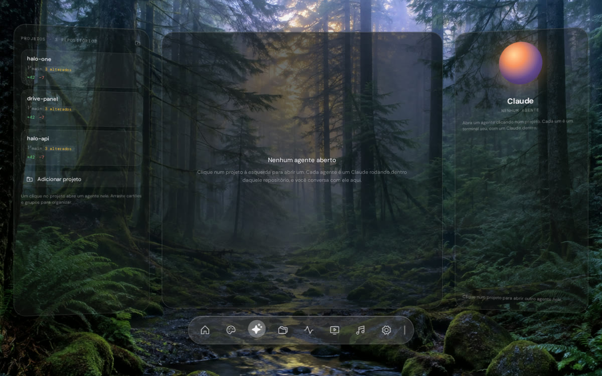 | 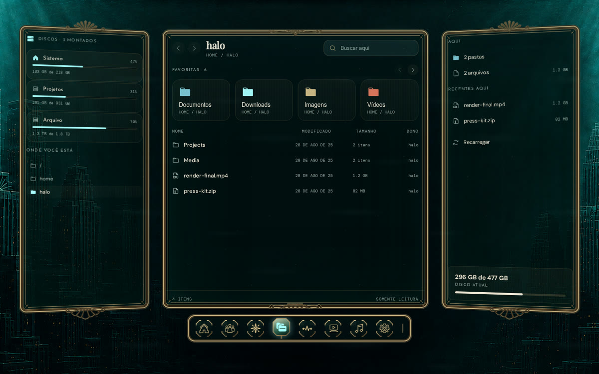 |
| A Claude Code agent per project, with history and attachments. | Disks and folders, **read-only** by design. |
| **Lab** | **Media** |
| 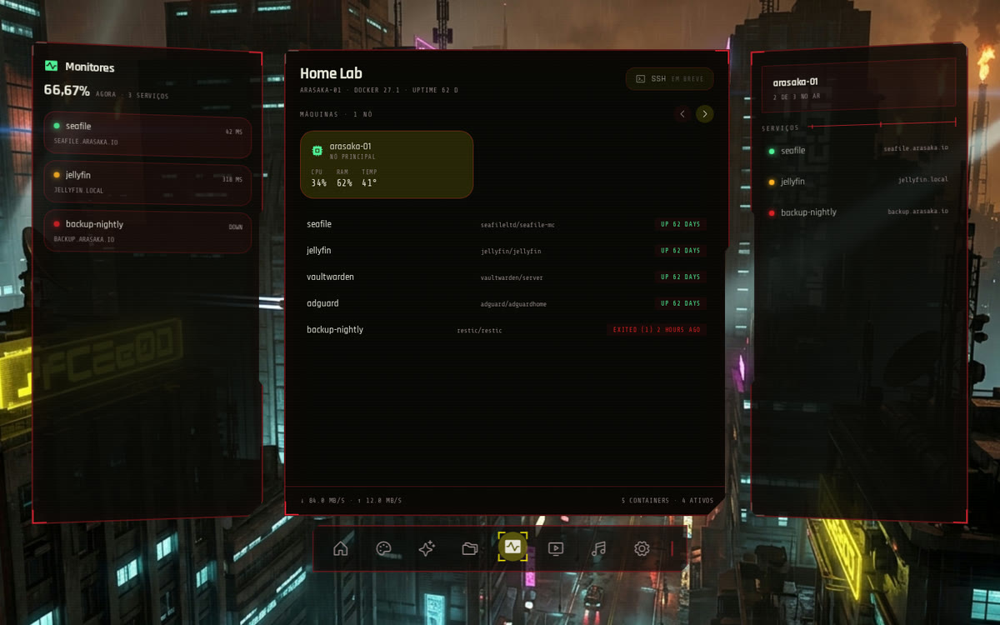 | 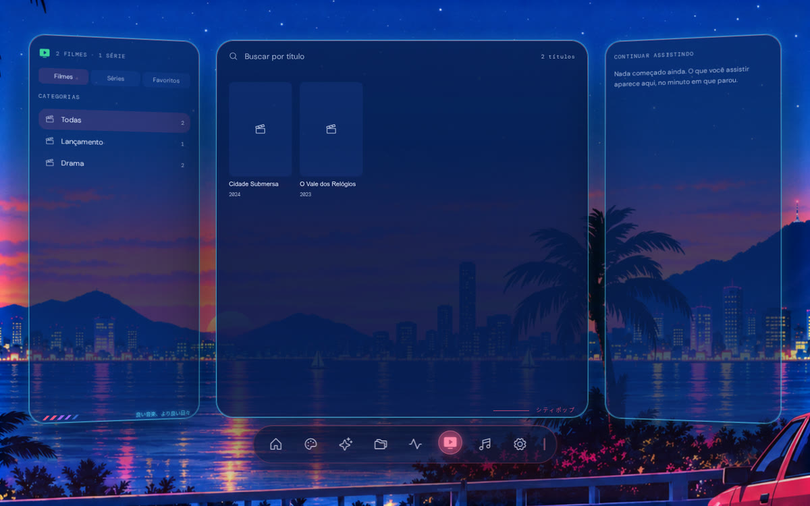 |
| Docker containers, services with latency and the machine's health. | Your M3U library, favorites and "continue watching". |
| **Music** | **Settings** |
| 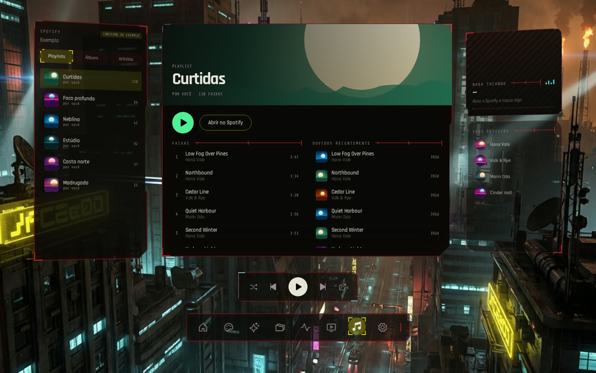 | 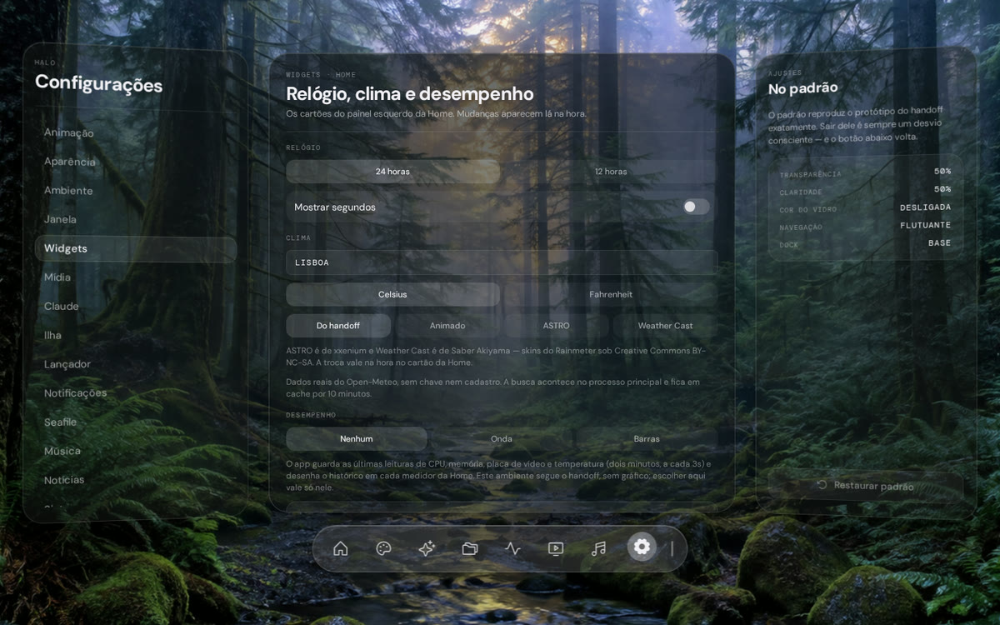 |
| Spotify playlists, albums and artists. | One section per topic, with "Restore default" in each. |

**Music and Spotify.** With just the **Spotify app installed** — nothing to set
up — Halo shows what's playing (title, artist, cover, progress) on Home and in
the island and controls play, pause, skip, shuffle and repeat, through MPRIS on
D-Bus: no account, no internet. The **API** is only needed for the Music screen
to list your playlists, saved albums and artists, and to control Spotify on
another device (that part requires Premium): create a free app on the Spotify
developer dashboard, paste the Client ID in Configurações → Música and click
Conectar. Sign-in opens in your system browser.

**Claude.** The Claude screen and the island's Claude run the **Claude Code
CLI**, installed separately. Without it, the screen says so and takes you to
Configurações → Claude. Agents start in `plan` mode (read-only) — letting them
edit files is your explicit choice. The optional **mascot** reads classic
Microsoft Agent characters (`.acs`: Genie, Merlin, Clippit…); you can find them
at [tmafe.com/classic-ms-agents](https://tmafe.com/classic-ms-agents/).

**Media.** Point Halo at your own M3U list and it becomes a library with
categories, favorites and "continue watching"; with a free TMDB key, each title
gets synopsis, cast and poster. The player can stay on top of every window.

> [!NOTE]
> **Everything on this page is demo data.** The images and videos are generated
> by `node tools/vitrine.mjs` from the built app running outside Electron, where
> it falls back to its mocks — plus covers, posters and an island snapshot
> drawn by `tools/vitrine-demo.mjs`. The songs, films, projects and
> notifications are made up, and nothing comes from a real screen. On your
> machine, the screens show your data.

## Requirements

Halo is built for **one** environment and doesn't try to be compatible with
everything. It was developed and tested on a single machine; that is what's
guaranteed, and the rest is "should work" without anyone having checked.

| | Tested on | Requires |
|---|---|---|
| Distribution | Ubuntu 26.04.1 LTS, kernel 7.0 | a recent Ubuntu (or Debian derivative) |
| Desktop | KDE Plasma 6.6.6, KWin 6.6.6, Qt 6.10 | **KDE Plasma 6** |
| Session | Wayland, with the app on X11 through Xwayland 24.1 | X11, **or** Wayland with Xwayland (Plasma's default) |
| Graphics | NVIDIA, proprietary driver | any GPU — the GPU meter only reads NVIDIA |
| Monitors | more than one | one or more — on screens narrower than 1440 px the window is centered |
| To build | Node 22, Electron 44 | Node 22 or newer |

The app **always** runs as an X11 client (`--ozone-platform=x11`): only there
can it sink to the wallpaper layer, remember its position and keep the player
on top. On a Wayland session that goes through Xwayland, which Plasma already
ships. **Outside KDE** the app opens, but the island, the launcher, the tray,
the notification bubbles and the wallpaper switch don't work.

## Installation

1. Download the latest `.deb` from [Releases](https://github.com/jrcn1991/app_halo-spatial-os/releases/latest).
2. Install it:

   ```bash
   sudo apt install ./halo-spatial-os_0.2.2_amd64.deb
   ```

3. Open **Halo** from the application menu.

The `.deb` pulls in the essential programs and installs the AppArmor profile
Electron needs on Ubuntu. An AppImage is built too, but it needs `libfuse2t64`
and may hit Ubuntu's user-namespace restriction — prefer the `.deb`.

> [!TIP]
> After installing, open **Configurações (Settings) → Sistema (System)**: it
> lists every missing program, what you lose without it and the `apt` command
> to install it.

## Quick start

- **The first launch shows the window.** From the second one on, Halo starts
  collapsed: the **island** at the top of the screen and the **tray icon** stay,
  and **Meta+Space**, the Halo row in the island or the tray icon bring the
  window back. To always open visible, turn this off in Configurações → Janela
  (Window).
- **Switch environments** in the right panel of Home.
- **Turn the launcher on** in Configurações → Lançador (Launcher) to use
  **Meta+V**.
- **Pick the weather city** in Configurações → Widgets.
- **Switch the language** in Configurações → Idioma (Language): Portuguese
  (default) or English.

## Settings

Everything lives in **Configurações** (the gear in the dock). The menu starts
with the look of the app — **Idioma** (Language), **Aparência** (Appearance:
transparency, brightness, glass color), **Ambiente** (Environment), **Animação**
(Animation) and **Janela** (Window) — then a group of **Integrações**
(Integrations): Widgets, Mídia, Claude, Ilha, Lançador, Notificações, Seafile,
Música and Notícias (News). **Sistema** (System) and **Sobre** (About) close the
list. Glass preferences are **per environment** — changing Floresta doesn't
change Cyberpunk — and every section has its own "Restaurar padrão" (restore
default).

The file lives at `~/.config/halo-spatial-os/settings.json` and can be edited
by hand.

### System programs

The app calls 27 system programs and bundles none of them. There is a single
list (`src/shared/dependencias.ts`), read by `npm run doctor`, Configurações →
Sistema and the `.deb`. Details in [DOCUMENTATION.md](DOCUMENTATION.md).

**Essential** — the `.deb` installs them:

| Program | Package | Without it |
|---|---|---|
| `gio` | `libglib2.0-bin` | opening apps from the launcher or the island |
| `busctl` | `systemd` | now playing, media keys, phone and Bluetooth |
| `pactl` | `pulseaudio-utils` | the island's audio and the volume HUD (works with PipeWire) |

**From KDE Plasma** — they come with it:

| Program | Package | Without it |
|---|---|---|
| `qdbus6` | `qdbus-qt6` | the island loses windows and focus; the launcher doesn't open |
| `kwriteconfig6` | `libkf6config-bin` | turning the island off leaves its shortcut in KDE |
| `plasma-apply-wallpaperimage` | `plasma-workspace` | switching environments only changes Halo's theme |
| `spectacle` | `kde-spectacle` | screenshots and on-screen text |

**Optional** — each one costs a single reading or action, and the screen says
when it's missing:

| Program | Package | Without it |
|---|---|---|
| `parec` | `pulseaudio-utils` | the spectrum becomes an animation instead of following the sound |
| `dbus-monitor` | `dbus-bin` | the island receives no notifications |
| `nmcli` | `network-manager` | the island's network module |
| `bluetoothctl` | `bluez` | the island's Bluetooth module |
| `udisksctl` | `udisks2` | mounting and ejecting USB drives from the island |
| `tesseract` | `tesseract-ocr tesseract-ocr-por tesseract-ocr-eng` | on-screen text (OCR) |
| `notify-send` | `libnotify-bin` | the end-of-timer alert |
| `sensors` | `lm-sensors` | temperature on Home and in the island |
| `nvidia-smi` | NVIDIA driver (`sudo ubuntu-drivers install`) | the GPU meter shows "no reading" |
| `docker` | `docker.io` (and your user in the `docker` group) | containers on the Lab screen |
| `git` | `git` | the projects card on Home |
| `lsblk`, `df` | `util-linux`, `coreutils` | disks in Files and in the island |
| `ps`, `systemctl`, `ss`, `hostname` | `procps`, `systemd`, `iproute2`, `hostname` | "who's heavy", services, ports and IP in the island |
| `xdg-user-dir` | `xdg-user-dirs` | the screenshots folder falls back to `~/Pictures` |
| `claude` | Claude Code, installed separately | the Claude screen and the island's Claude |

All at once, except the driver and Claude Code:

```bash
sudo apt install libglib2.0-bin systemd pulseaudio-utils dbus-bin \
  qdbus-qt6 libkf6config-bin plasma-workspace kde-spectacle \
  network-manager bluez udisks2 lm-sensors libnotify-bin \
  tesseract-ocr tesseract-ocr-por tesseract-ocr-eng git docker.io
```

### What's yours, and doesn't come with the app

Each screen tells you where to set it up while it's missing:

- **Media** — your own M3U list (Configurações → Mídia) and, for synopsis and
  cast, a free TMDB key.
- **Music** — nothing for now playing and playback controls (the Spotify app is
  enough); for playlists, albums, artists and other devices, a free app on the
  Spotify developer dashboard, with its Client ID in Configurações → Música.
- **Claude** — the Claude Code CLI, installed separately.
- **News** — the Home reading column starts with Tecnoblog, CNN Brasil and BBC
  World; swap them in Configurações → Notícias.
- **Seafile** — only if you have a server on your local network.
- **Mascot** — Microsoft Agent `.acs` characters
  ([tmafe.com/classic-ms-agents](https://tmafe.com/classic-ms-agents/)).
- **Video wallpaper** — needs a separate Plasma video wallpaper plugin
  (`org.local.videowallpaper`); without it the environment keeps its image.

### What Halo changes outside itself

Settings live in `~/.config/halo-spatial-os/`, and wallpapers and mascots in
`~/.local/share/halo-spatial-os/`. Beyond that, four things, each with its own
switch:

| What | Where | Default | How to turn off |
|---|---|---|---|
| Session wallpaper | Plasma, through `plasma-apply-wallpaperimage` | **on** — acts when switching environments | Configurações → Ambiente |
| KWin "drawer" effect | `~/.local/share/kwin[-wayland]/effects/halo-gaveta/` | **on**, with the island | Configurações → Ilha (turning off removes it) |
| Global shortcuts (Meta+Space and others) | `~/.config/kglobalshortcutsrc` | **on**, with the island | Configurações → Ilha (turning off deletes them) |
| Meta+V taken from Klipper | kglobalaccel, over D-Bus | off | Configurações → Lançador (turning off gives it back) |

And one that writes nothing but changes what you see: **the notification
bubbles**. Off on a fresh install. Turned on in Configurações → Notificações,
Halo hides Plasma's bubbles and draws its own, dressed by the environment;
history and the bell stay with Plasma, and closing Halo gives the bubbles back
right away.

**Before uninstalling**, turn off the island and the launcher in Settings —
that deletes the shortcuts and the effect and gives Meta+V back to Klipper.
Uninstalling the package doesn't touch your home folder.

## Privacy

- **No telemetry, no account.** Halo reads your machine locally and sends
  nothing about it anywhere.
- **The network is only what you turn on:** weather (Open-Meteo), the news
  feeds you keep, song lyrics for the island (LRCLIB), the Social Arte sources,
  TMDB and Spotify when you set them up. Network and disk access live in the
  main process only; the interface can load nothing but cover images from a
  short, listed set of hosts.
- **Keys stay on your computer**, in `settings.json`. Tokens never travel on the
  command line, and the interface never sees them.
- **Third-party sign-ins open in your system browser** (Spotify uses OAuth with
  PKCE), never in a password field drawn by Halo. The two documented exceptions
  are the Seafile server on your own local network and the platform's own login
  page for Social Arte.
- **Files are read-only.** There is no write, delete, rename or execute
  operation — not in the service, not in the IPC contract.

## Troubleshooting

- **I opened it and nothing showed up.** Halo starts collapsed: hover the island
  at the top of the screen, press **Meta+Space** or click the tray icon. If none
  of them shows up, the session may not be KDE — Halo needs Plasma 6.
- **Temperature, GPU or an island section is missing.** A system program is
  missing: see **Configurações → Sistema**.
- **The wallpaper doesn't change.** Check the switch in Configurações →
  Ambiente and whether `plasma-apply-wallpaperimage` is installed.
- **Meta+V still opens Klipper.** Turn the launcher on in Configurações →
  Lançador; turning it off gives the key back to Klipper.
- **The Claude screen asks for the CLI.** Install Claude Code separately; if
  Halo doesn't find it, point to it in Configurações → Claude.

## Building from source

```bash
npm install
npm run dev        # Electron with reload (on X11)
npm run check      # typecheck, lint, build, screen and layout tests
npm run dist       # builds the .deb and the AppImage in dist/
npm run build && node tools/vitrine.mjs   # regenerates the images on this page
```

The rest — architecture decisions, how each integration works and how to verify
a change — is in **[DOCUMENTATION.md](DOCUMENTATION.md)**
([português](DOCUMENTACAO.md)).

## Roadmap

- [x] Eight screens of glass panels, with real data
- [x] Four environments, with wallpaper (image or video)
- [x] Dynamic island, Meta+V launcher and themed notification bubbles
- [x] Claude Code agents, Spotify, M3U library and Social Arte
- [x] English interface option (Portuguese stays the default)
- [ ] The Estúdio, Espaço and Costa environments
- [ ] Spotify catalog search
- [ ] GPU meter for AMD and Intel

## License

The code is **GPL-3.0-or-later** ([LICENSE](LICENSE)). What comes from third
parties — fonts, icons, libraries and data fetched at runtime — is listed in
**[THIRD-PARTY.md](THIRD-PARTY.md)**, with what each license requires.

> [!IMPORTANT]
> The two weather icon sets (`src/renderer/assets/weather/astro/` and
> `weathercast/`) are **not under the GPL**: they are **CC BY-NC-SA**
> (non-commercial), by their authors. Details in [THIRD-PARTY.md](THIRD-PARTY.md).

Halo is a personal, free project, **with no commercial purpose**. The
environments are inspirations with original art: **Shock** comes from the
underwater art deco of *BioShock* (a 2K trademark), and **Cyberpunk** from the
genre's aesthetic and *Cyberpunk 2077* (by CD Projekt Red). No affiliation with
the studios. Microsoft Agent characters are not distributed with Halo.

Made by [Rafael Neves](https://github.com/jrcn1991).

## Inspiration and thanks

Halo wouldn't exist without these projects and works, which showed the way:

**Dynamic island and notch**

- [**Boring Notch**](https://github.com/TheBoredTeam/boring.notch) — the Mac
  notch as a music center, shelf and HUD; the reference for how an island
  should behave, and for this README.
- [**Atoll**](https://github.com/Ebullioscopic/Atoll) — the island as a command
  surface, with live activities and system meters; this README's structure
  comes from it.
- [**Notchy**](https://notchy.dev/) — the island as a complete product; its
  website inspired [Halo's](https://jrcn1991.github.io/app_halo-spatial-os/).
- [**dynamic-island-projects**](https://github.com/aeusteixeira/dynamic-island-projects)
  — projects and Claude Code sessions in a notch-style drop on Windows: the idea
  of bringing Claude into the pill.

**Design**

- [**Vision Pro Application**](https://dribbble.com/shots/21707259-Vision-Pro-Application)
  (Dribbble) — glass panels tilted in space, Halo's visual grammar.
- [**Cyberpunk 2077 — UI/UX In-game Ads**](https://www.behance.net/gallery/131293967/Cyberpunk-2077-UIUX-In-game-Ads)
  (Behance) — the screen language of the Cyberpunk environment.

**Data and pieces**

- [Open-Meteo](https://open-meteo.com) — weather, no key needed.
- [TMDB](https://www.themoviedb.org) — synopsis, cast and posters for the
  library. *This product uses the TMDB API but is not endorsed or certified by
  TMDB.*
- [LRCLIB](https://lrclib.net) — synced lyrics in the island.
- The Rainmeter skins the weather icons came from, the DM font family and
  Phosphor icons — full credits in [THIRD-PARTY.md](THIRD-PARTY.md).
