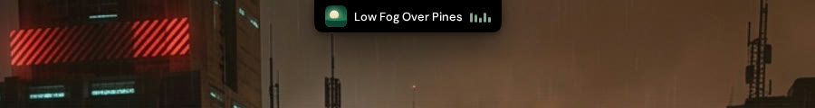
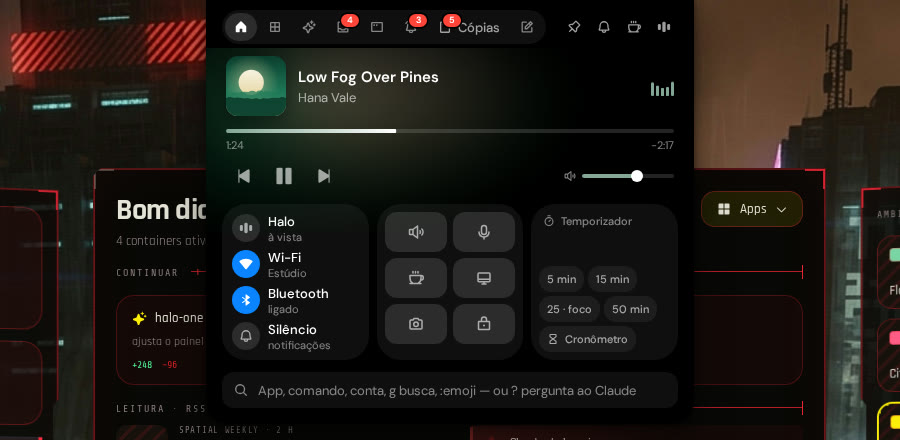

<p align="center">
  
</p>

<h1 align="center">Halo — Spatial OS</h1>

<p align="center"><a href="README.md">English</a> · <b>Português (Brasil)</b></p>

<p align="center">
  <b>Painéis de vidro flutuando sobre a sua área de trabalho, e uma ilha dinâmica no topo da tela.</b><br>
  Para Linux com KDE Plasma 6.
</p>

<p align="center">
  <a href="https://github.com/jrcn1991/halo-spatial-os/releases/latest"></a>
  <a href="https://jrcn1991.github.io/halo-spatial-os/"></a>
</p>

<p align="center">
  
  
  
  <a href="LICENSE"></a>
</p>

Diga olá ao **Halo**: um jeito de fazer a área de trabalho do Linux parecer um
sistema espacial. A janela é **transparente** — não há fundo nenhum, só painéis
de vidro inclinados em 3D que flutuam sobre o seu papel de parede e nunca cobrem
as outras janelas. No topo da tela mora uma **ilha dinâmica**, à moda do notch
do Mac: música, temporizadores, cópias, notificações e um lançador que responde
a um atalho. E cada **ambiente** troca o tema do app e o papel de parede da
sessão de uma vez.

<p align="center">
  <a href="https://jrcn1991.github.io/halo-spatial-os/#passeio"></a>
  <br>
  <sub>▶ <a href="https://jrcn1991.github.io/halo-spatial-os/#passeio">Assista ao passeio completo, por todas as telas</a></sub>
</p>

---

## Destaques

- **Oito telas em painéis de vidro** — Home, Social, Claude, Arquivos, Lab,
  Mídia, Música e Configurações, cada uma com três painéis e um dock.
- **Ilha dinâmica** no topo da tela: a faixa tocando, temporizadores, cópias
  recentes, Wi-Fi, Bluetooth, captura, texto da tela (OCR), cafeína e um campo
  que abre apps, roda comandos e pergunta ao Claude.
- **Quatro ambientes** — Floresta, City Pop, Cyberpunk e Shock — que
  trocam o tema da interface **e** o papel de parede (imagem ou vídeo) da
  sessão do Plasma.
- **Dados de verdade da sua máquina**: CPU, memória, GPU e temperatura, seus
  repositórios git, containers do Docker, discos, o que está tocando (MPRIS) e
  as suas contas.
- **Agentes do Claude Code** por projeto, com histórico de conversas e um
  mascote do Microsoft Agent opcional (Genie, Merlin, Clippit).
- **Biblioteca de mídia** a partir da sua lista M3U, com sinopse e elenco do
  TMDB, e um player que fica por cima de tudo quando você quer.
- **Spotify** com playlists, álbuns, artistas e controle de reprodução.

## Outros recursos

- **Lançador no Meta+V** — o mesmo motor do campo da ilha, numa janela vestida
  pelo ambiente.
- **Balões de notificação no estilo do tema** — o Plasma continua servidor; o
  Halo só redesenha o balão (desligado até você ligar).
- **Mora na bandeja**: a janela vive na camada do papel de parede, fora da
  barra de tarefas, e volta com um clique no ícone ou com Meta+Espaço.
- **Social Arte** — um agregador pessoal de referências do DeviantArt, ArtStation,
  Behance, Pinterest e Thingiverse, só leitura.
- **Nada inventado sem aviso**: sem conta, sem chave ou sem programa, a tela diz
  o que falta e onde configurar.

<p align="center">
  
</p>

## Ambientes

| Floresta | City Pop |
|:---:|:---:|
|  |  |
| **Cyberpunk** | **Shock** |
|  |  |

## As telas

| Música | Lab |
|:---:|:---:|
|  |  |
| **Claude** | **Arquivos** |
|  |  |
| **Social** | **Mídia** |
|  |  |

## A ilha

<p align="center">
  
  <br><br>
  
</p>

Passe o mouse (ou clique, se preferir) na pílula para abrir. A ilha é
desligada por padrão: ligue em **Configurações → Ilha**.

> [!NOTE]
> As imagens desta página foram geradas com os **dados de demonstração** do app
> (`node tools/vitrine.mjs`), sobre os papéis de parede dos próprios ambientes.
> Na sua máquina, as telas mostram os seus dados.

## Requisitos

O Halo é feito para **um** ambiente, e não tenta ser compatível com todos. Foi
desenvolvido e testado numa máquina só; é isso que está garantido, e o resto é
"deve funcionar" sem ninguém ter olhado.

| | Testado em | Precisa de |
|---|---|---|
| Distribuição | Ubuntu 26.04.1 LTS, kernel 7.0 | Ubuntu (ou derivado Debian) recente |
| Área de trabalho | KDE Plasma 6.6.6, KWin 6.6.6, Qt 6.10 | **KDE Plasma 6** |
| Sessão | Wayland, com o app em X11 pelo Xwayland 24.1 | X11, **ou** Wayland com Xwayland (o padrão do Plasma) |
| Vídeo | NVIDIA, driver proprietário | qualquer placa — o medidor de GPU só lê NVIDIA |
| Monitores | mais de um | um ou mais |
| Para compilar | Node 22, Electron 44 | Node 22 ou mais novo |

O app **sempre** abre como cliente X11 (`--ozone-platform=x11`): só ali ele
consegue descer para a camada do papel de parede, lembrar a posição e manter o
player por cima. Numa sessão Wayland isso passa pelo Xwayland, que o Plasma já
traz. **Fora do KDE** o app abre, mas a ilha, o lançador, a bandeja, os balões
de notificação e a troca de papel de parede não funcionam.

## Instalação

1. Baixe o `.deb` mais recente em [Releases](https://github.com/jrcn1991/halo-spatial-os/releases/latest).
2. Instale:

   ```bash
   sudo apt install ./halo-spatial-os_0.2.0_amd64.deb
   ```

3. Abra o **Halo** pelo menu de aplicativos.

O `.deb` puxa os programas essenciais e instala o perfil do AppArmor de que o
Electron precisa no Ubuntu. O AppImage também é gerado, mas exige
`libfuse2t64` e pode esbarrar no bloqueio de namespaces do Ubuntu — prefira o
`.deb`.

> [!TIP]
> Depois de instalar, abra **Configurações → Sistema**: a tela lista cada
> programa que falta, o que se perde sem ele e o comando `apt` para instalar.

## Início rápido

- **A primeira abertura mostra a janela.** Da segunda em diante o Halo nasce
  recolhido: fica o ícone na bandeja (perto do relógio), e é ele que traz a
  janela. Para abrir sempre visível, desligue em Configurações → Janela.
- **Troque de ambiente** no painel direito da Home. Antes da primeira troca, o
  Halo guarda o seu papel de parede; **Configurações → Ambiente → Restaurar o
  meu papel de parede** o devolve.
- **Ligue a ilha** em Configurações → Ilha. Com ela, **Meta+Espaço** recolhe e
  traz o app, e o campo da ilha abre apps e comandos.
- **Ligue o lançador** em Configurações → Lançador para usar o **Meta+V**.
- **Escolha a cidade do clima** em Configurações → Widgets.
- **Troque o idioma** em Configurações → Idioma: português (padrão) ou inglês.

## Configurações

Tudo fica em **Configurações** (a engrenagem no dock), uma seção por assunto:
animação, aparência (transparência, claridade, cor do vidro), ambiente, janela,
widgets, mídia, Claude, ilha, lançador, notificações, Seafile, música, notícias
e sistema. As preferências do vidro são **por ambiente** — mexer na Floresta
não muda o Cyberpunk — e cada seção tem o seu "Restaurar padrão".

O arquivo vive em `~/.config/halo-spatial-os/settings.json`, editável à mão.

### Programas do sistema

O app chama 26 programas do sistema e não embute nenhum. A lista é uma só
(`src/shared/dependencias.ts`), e é ela que o `doctor`, Configurações → Sistema
e o `.deb` leem. Detalhes em [DOCUMENTACAO.md](DOCUMENTACAO.md).

**Essenciais** — o `.deb` os instala:

| Programa | Pacote | Sem ele |
|---|---|---|
| `gio` | `libglib2.0-bin` | abrir aplicativo pelo lançador ou pela ilha |
| `busctl` | `systemd` | "tocando agora", teclas de mídia, celular e Bluetooth |
| `pactl` | `pulseaudio-utils` | o áudio da ilha e o HUD de volume (funciona com PipeWire) |

**Do KDE Plasma** — já vêm com ele:

| Programa | Pacote | Sem ele |
|---|---|---|
| `qdbus6` | `qdbus-qt6` | a ilha perde janelas e foco; o lançador não abre |
| `kwriteconfig6` | `libkf6config-bin` | desligar a ilha deixa o atalho gravado no KDE |
| `plasma-apply-wallpaperimage` | `plasma-workspace` | trocar de ambiente muda só o tema do Halo |
| `spectacle` | `kde-spectacle` | captura de tela e "texto da tela" |

**Opcionais** — cada um custa só uma leitura ou uma ação, e a tela diz quando
falta:

| Programa | Pacote | Sem ele |
|---|---|---|
| `parec` | `pulseaudio-utils` | o espectro vira animação, em vez de seguir o som |
| `dbus-monitor` | `dbus-bin` | a ilha não recebe notificações |
| `nmcli` | `network-manager` | o módulo de rede da ilha |
| `bluetoothctl` | `bluez` | o módulo de Bluetooth da ilha |
| `udisksctl` | `udisks2` | montar e ejetar pendrive pela ilha |
| `tesseract` | `tesseract-ocr tesseract-ocr-por tesseract-ocr-eng` | "texto da tela" (OCR) |
| `notify-send` | `libnotify-bin` | o aviso de fim de temporizador |
| `sensors` | `lm-sensors` | a temperatura na Home e na ilha |
| `nvidia-smi` | driver NVIDIA (`sudo ubuntu-drivers install`) | o medidor de GPU diz "sem leitura" |
| `docker` | `docker.io` (e o usuário no grupo `docker`) | containers na tela Lab |
| `git` | `git` | o cartão de projetos da Home |
| `lsblk`, `df` | `util-linux`, `coreutils` | discos em Arquivos e na ilha |
| `ps`, `systemctl`, `ss`, `hostname` | `procps`, `systemd`, `iproute2`, `hostname` | "quem pesa", serviços, portas e IP na ilha |
| `xdg-user-dir` | `xdg-user-dirs` | a pasta de capturas cai em `~/Pictures` |
| `claude` | Claude Code, instalado à parte | a tela do Claude e o Claude da ilha |

Tudo de uma vez, menos o driver e o Claude Code:

```bash
sudo apt install libglib2.0-bin systemd pulseaudio-utils dbus-bin \
  qdbus-qt6 libkf6config-bin plasma-workspace kde-spectacle \
  network-manager bluez udisks2 lm-sensors libnotify-bin \
  tesseract-ocr tesseract-ocr-por tesseract-ocr-eng git docker.io
```

### O que é seu, e não vem com o app

Cada tela diz onde configurar enquanto falta:

- **Mídia** — uma lista M3U sua (Configurações → Mídia) e, para sinopse e
  elenco, uma chave gratuita do TMDB.
- **Música** — um app gratuito no painel de desenvolvedor do Spotify, com o
  Client ID em Configurações → Música.
- **Seafile** — só se houver um servidor na sua rede local.
- **Mascote** — personagens `.acs` do Microsoft Agent que você já tenha.
- **Vídeo de fundo** — exige um plugin de vídeo do Plasma à parte
  (`org.local.videowallpaper`); sem ele o ambiente fica com a imagem.

### O que o Halo muda fora dele

As configurações ficam em `~/.config/halo-spatial-os/`, e papéis de parede e
mascotes em `~/.local/share/halo-spatial-os/`. Além disso, quatro coisas, cada
uma com interruptor:

| O quê | Onde | Padrão | Como desligar |
|---|---|---|---|
| Papel de parede da sessão | Plasma, pelo `plasma-apply-wallpaperimage` | **ligado** — age ao trocar de ambiente | Configurações → Ambiente |
| Efeito "gaveta" do KWin | `~/.local/share/kwin[-wayland]/effects/halo-gaveta/` | só com a ilha ligada | Configurações → Ilha (desligar remove) |
| Atalhos globais (Meta+Espaço e outros) | `~/.config/kglobalshortcutsrc` | só com a ilha ligada | Configurações → Ilha (desligar apaga) |
| Meta+V tirado do Klipper | kglobalaccel, por D-Bus | desligado | Configurações → Lançador (desligar devolve) |

E uma que não grava nada, mas muda o que se vê: **os balões de notificação**.
Desligados numa instalação nova. Ligados em Configurações → Notificações, o
Halo esconde os balões do Plasma e desenha os dele, vestidos pelo ambiente; o
histórico e o sino continuam com o Plasma, e fechar o Halo devolve os balões na
hora.

**Antes de desinstalar**, desligue a ilha e o lançador em Configurações — é o
que apaga os atalhos e o efeito e devolve o Meta+V ao Klipper. Desinstalar o
pacote não mexe na pasta pessoal.

## Solução de problemas

- **Abri e não apareceu nada.** O Halo está recolhido: clique no ícone dele na
  bandeja. Se nem o ícone aparecer, a sessão pode não ser KDE — o Halo precisa
  do Plasma 6.
- **A temperatura, a GPU ou uma seção da ilha não aparecem.** Falta um programa
  do sistema: veja **Configurações → Sistema**.
- **O papel de parede não troca.** Confira o interruptor em Configurações →
  Ambiente e se o `plasma-apply-wallpaperimage` está instalado.
- **O Meta+V ainda abre o Klipper.** Ligue o lançador em Configurações →
  Lançador; desligar devolve a tecla ao Klipper.

## Compilar a partir do código

```bash
npm install
npm run dev        # Electron com recarga (em X11)
npm run check      # typecheck, lint, build, testes de tela e de layout
npm run dist       # gera o .deb e o AppImage em dist/
```

O resto — as decisões de arquitetura, como cada integração funciona e como
verificar uma mudança — está em **[DOCUMENTACAO.md](DOCUMENTACAO.md)**
([English](DOCUMENTATION.md)).

## Roadmap

- [x] Oito telas em painéis de vidro, com dados reais
- [x] Quatro ambientes, com papel de parede (imagem ou vídeo)
- [x] Ilha dinâmica, lançador no Meta+V e balões de notificação do tema
- [x] Agentes do Claude Code, Spotify, biblioteca M3U e Social Arte
- [x] Opção de interface em inglês (o português continua o padrão)
- [ ] Os ambientes Estúdio, Espaço e Costa
- [ ] Busca no catálogo do Spotify
- [ ] Medidor de GPU para AMD e Intel

## Licença

O código é **GPL-3.0-or-later** ([LICENSE](LICENSE)). O que vem de terceiros —
fontes, ícones, bibliotecas e os dados buscados em tempo de execução — está em
**[THIRD-PARTY.md](THIRD-PARTY.md)**, com o que cada licença exige.

> [!IMPORTANT]
> Os dois conjuntos de ícone do clima (`src/renderer/assets/weather/astro/` e
> `weathercast/`) **não estão sob a GPL**: são **CC BY-NC-SA** (não comercial),
> dos autores deles. Detalhes em [THIRD-PARTY.md](THIRD-PARTY.md).

O Halo é um projeto pessoal e gratuito, **sem fins comerciais**. Os ambientes
são inspirações, com arte própria: o **Shock** vem do art déco subaquático de
*BioShock* (marca da 2K), e o **Cyberpunk** da estética do gênero e de
*Cyberpunk 2077* (da CD Projekt Red). Nenhum vínculo com os estúdios.

## Inspirações e agradecimentos

O Halo não existiria sem estes projetos e trabalhos, que mostraram o caminho:

**Ilha dinâmica e notch**

- [**Boring Notch**](https://github.com/TheBoredTeam/boring.notch) — o notch do
  Mac como centro de música, prateleira e HUD; a referência de como uma ilha
  deve se comportar, e deste README.
- [**Atoll**](https://github.com/Ebullioscopic/Atoll) — a ilha como superfície
  de comando, com atividades ao vivo e medidores do sistema; a organização
  deste README vem dele.
- [**Notchy**](https://notchy.dev/) — a ilha como produto completo, e a
  página dele inspirou a [página do Halo](https://jrcn1991.github.io/halo-spatial-os/).
- [**dynamic-island-projects**](https://github.com/aeusteixeira/dynamic-island-projects)
  — a ilha com os projetos e as sessões do Claude Code, no Windows: a ideia de
  levar o Claude para a pílula.

**Design**

- [**Vision Pro Application**](https://dribbble.com/shots/21707259-Vision-Pro-Application)
  (Dribbble) — os painéis de vidro inclinados no espaço, que são a gramática
  visual do Halo.
- [**Cyberpunk 2077 — UI/UX In-game Ads**](https://www.behance.net/gallery/131293967/Cyberpunk-2077-UIUX-In-game-Ads)
  (Behance) — a linguagem das telas do ambiente Cyberpunk.

**Dados e peças**

- [Open-Meteo](https://open-meteo.com) — o clima, sem chave.
- [TMDB](https://www.themoviedb.org) — sinopse, elenco e capas da biblioteca.
  *Este produto usa a API do TMDB, mas não é endossado nem certificado pelo TMDB.*
- As skins do Rainmeter de onde vieram os ícones do clima, as fontes da família
  DM e os ícones do Phosphor — créditos completos em [THIRD-PARTY.md](THIRD-PARTY.md).
